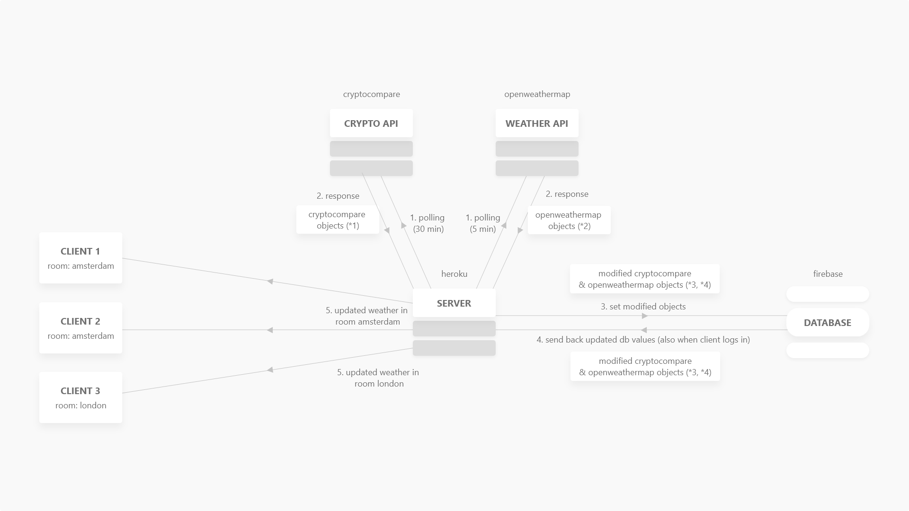
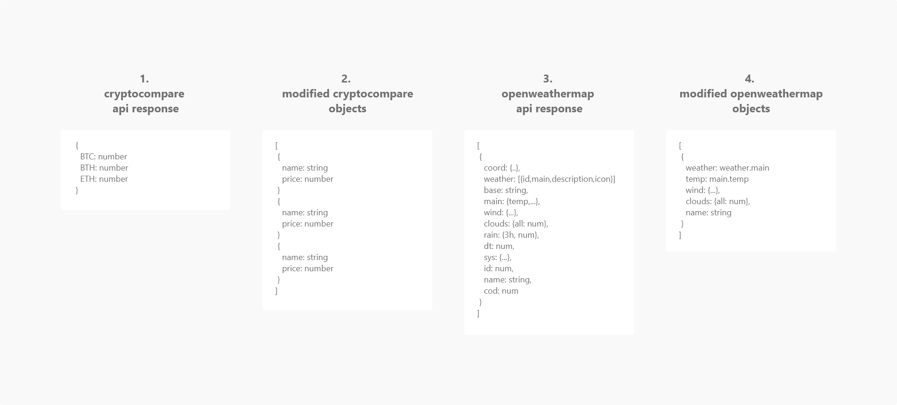
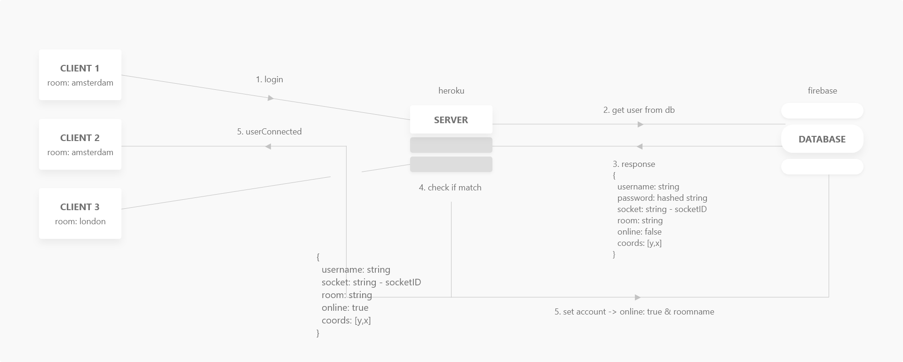
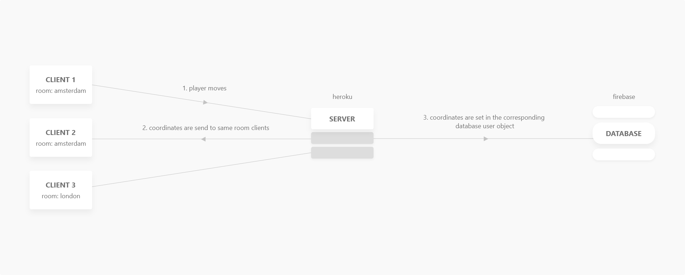
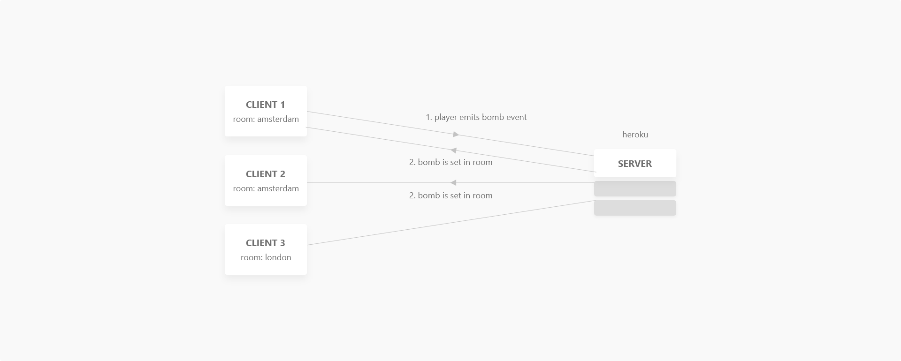
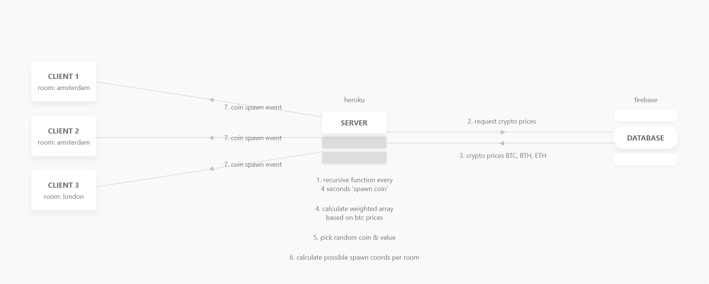

# Real-Time Web @cmda-minor-web · 2018-2019

## Summary
Simple MMO browser game based on web sockets. You can walk around a map and play against others to collect as many coins as possible while evading bombs from other players.


## Table of contents
1. [Install](#install)
2. [Demo](#demo)
3. [Concept](#concept)
4. [API Description](#api-description)
  - [openweathermap](#openweathermap)
  - [cryptocompare](#cryptocompare)
5. [Most important screen](#most-important-screen)
6. [Data life cycle](#data-life-cycle)
  - [api data life cycle](#api-data-life-cycle)
  - [login data life cycle](#login-data-life-cycle)
  - [game events data life cycle](#game-events-data-life-cycle)
7. [Possible extensions](#possible-extensions)

[Credits](#Credits)   
[License](#license)


## Install
Fork this project, then execute the following commands in your terminal:
```bash
## clone the github repo to your local environment
git clone https://github.com/YOUR-GH-USERNAME/real-time-web-1819.git

## Navigate to newly created project folder
cd real-time-web-1819

## Install dependencies
npm install

## Start live server
npm run dev
```

## Demo
Check the live demo [here](https://webdev-weatherworld.herokuapp.com)

## Concept
The goal of this online multiplayer game is to collect as many high valued coins and hit as many other players with your bombs as you can, so you will have the most points in a room!
There are multiple game rooms. Every game room corresponds to a specific city in the world (currently Amsterdam and London).
The rooms change their appearance based on the weather in the respective cities the room is based on.

Every 4 seconds a coin spawns in the room on a random location. The points picking one of these coins up depends on the type of coin and its corresponding current cryptocurrency value. The higher the value, the less likely it is to spawn.

When a player walks through an explosion from a bomb you dropped, you are awarded 1000 points while the affected player loses 1000 points (or gets their points reset to 0 if they have less than 1000 points.)

The goal of the game is to stay the highest scoring player in the game room while you are online.


## API Description
### Openweathermap
The [openweathermap API](https://openweathermap.org/api) is an api that delivers current weather from specific cities or places you request. The data is updated frequently, with the maximum update time being an hour.

Connection is made by using an API key.

The data returned is JSON, giving full detail of the current weather in the requested place(s). The connection with the api to the server consists of polling get requests every 5 minutes.

#### API Response
Per requested location, the response gives back a JSON object like this:
```js
[
  {
    "coord":{"lon":-0.13,"lat":51.51},
    "sys": {
      "type":1,
      "id":5091,
      "message":0.0034,
      "country":"GB",
      "sunrise":1485762036,
      "sunset":1485794875
    },
    "weather": [
      {"id":701,"main":"Mist","description":"mist","icon":"50d"},
      {"id":300,"main":"Drizzle","description":"light intensity drizzle","icon":"09d"}
    ],
    "main": {
      "temp":7,
      "pressure":1012,
      "humidity":81,
      "temp_min":5,
      "temp_max":8
    },
    "visibility":10000,
    "wind":{"speed":4.6,"deg":90},
    "clouds":{"all":90},
    "dt":1485793175,
    "id":2643743,
    "name":"London"
  },
  {
    ...
  }
]
```

In the server I reformat that to the following, which get's saved in the database:
```js
[
  {
    "weather": "mist"
    "temp": 7,
    "wind": {"speed":4.6,"deg":90},
    "clouds": {"all":90},
    "name": "london"
  },
  {
    ...
  }
]
```


### Cryptocompare
The [cryptocompare API](https://min-api.cryptocompare.com/) is an api that delivers current prices for almost all cryptocurrencies.
This game uses the prices for Bitcoin, Bitcoin cash and Ethereum.
The prices for these currencies update every 2 seconds.

Connection with the API requires an API key.

The data returned is JSON, giving full detail of the current weather in the requested place(s). The connection with the api to the server consists of polling get requests every 30 minutes, because the free plan includes a maximum of 100.000 requests per month, which equals around ~2.3 requests per hour when the server is constantly live.

#### API Response
The API gives the following response for the request for BTC, BCH and ETH (values in euro):
```js
{
  BTC: 4893.23,
  BCH: 247.01,
  ETH: 149.85,
}
```

Which i refactor on the server to:
```js
[
  {
    name: 'BTC',
    price: 4893.23
  },
  {
    name: 'BCH',
    price: 247.01
  },
  {
    name: 'ETH',
    price: 149.85
  }
]
```


## Most important screen


## Data life cycle
### API data life cycle


<details>
<summary>Description of data objects</summary>


</details>

### Login data life cycle


### Game events data life cycle

<details>
<summary>
Move event
</summary>


</details>

<details>
<summary>
Bomb event
</summary>


</details>

<details>
<summary>
Coin event
</summary>


</details>

## Possible extensions
- Giving game rooms different maps -> coin spawning is already taking this possiblity into account
- Having weather influence gameplay
- Add 32x32 sprites to players, coins and bombs
- Set a max to players in a game room
- Rewrite db functionality from firebase to mongo

## Credits
- [browserquest by mozilla](https://github.com/mozilla/BrowserQuest) - Open source graphics & sprites
- [bgrins](https://github.com/bgrins) - awesome javascript implementation of the A* pathfinding algorithm

## License
[MIT](LICENSE) @ [FollyWolly](https://github.com/follywolly)
