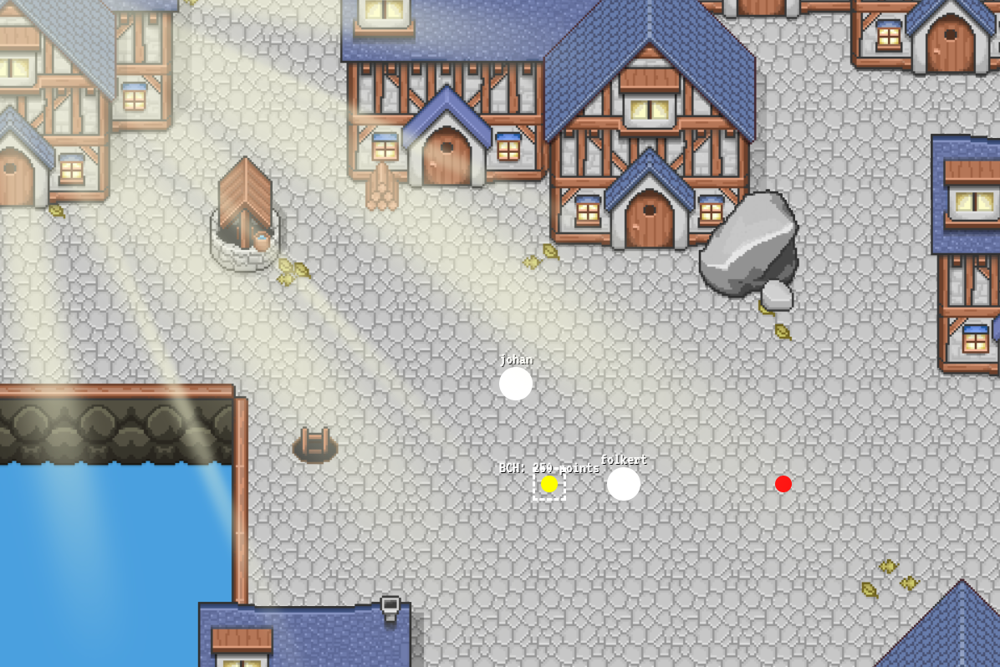

# Real-Time Web @cmda-minor-web · 2018-2019

## Summary
Simple MMO browser game based on web sockets

## Concept

## API Description
I make use of the weather API 

## Most important screen

## Data life cycle

## License
[MIT](LICENSE) @ [FollyWolly](https://github.com/follywolly)
