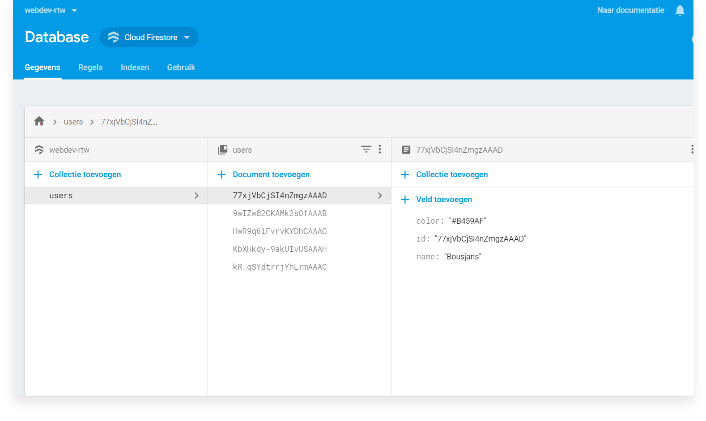

# Real-Time Web @cmda-minor-web · 2018-2019

## Summary
Little cheeky real-time chat app where you can walk around in the body of the document and chat with other people currently online.


## Table of contents
1. [Install](#install)
2. [Features](#features)
3. [Diagram](#diagram)
4. [Database](#database)

[License](LICENSE)

## Install
Fork this project, then execute the following commands in your terminal:
```bash
git clone https://github.com/YOUR-GITHUB-USERNAME/real-time-web-1819.git

cd real-time-web-1819
```
Then, you need a Firebase account with a firestore database.
All necessary credentials will be stored in a file you need to put in `/server`.

Then, in `/server/index.js` edit the following lines to match your firebase settings:
```js
const serviceAccount = require('./FIREBASE_KEY_FILENAME.json')

firebase.initializeApp({
  credential: firebase.credential.cert(serviceAccount),
  databaseURL: 'https://YOUR-FIREBASE-PROJECT-NAME.firebaseio.com'
})

```

Now run `npm run dev` to start a dev server on localhost:3000

## Features
- [Socket.io](https://socket.io) (real time connections)
- [Firebase](https://firebase.google.com) (database)

## Diagram
This is how the datastreams flow throught the different actors in the project:


## Database
This is how the database looks when people are online:


## License
[MIT](LICENSE) @ [FollyWolly](https://github.com/follywolly)
